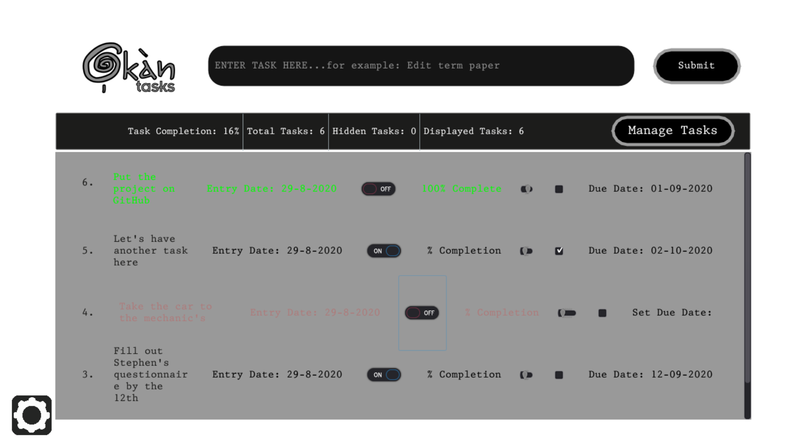
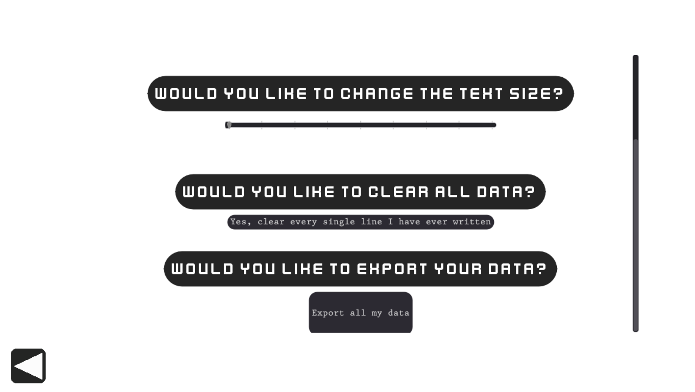

# Okan_Task Manager
<h3>A simple task management applet built with the Godot Engine.</h3>

<h4>Demo video available here:</h4>
https://www.youtube.com/watch?v=3_yjPxktibA&t=432s

Built off the 'Great Grateful Journal' by NAD LABS 
as a starting point and then modified to fit a different context.
(https://github.com/aimforbigfoot/Great-Grateful-Journal, https://youtu.be/V_SoXu6duYE) 

Further optimization and feature integration will be implemented over time.
Comments and pull requests are welcome.

<h4>Screenshots</h4>

